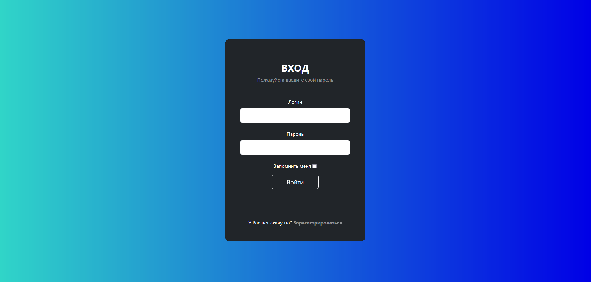
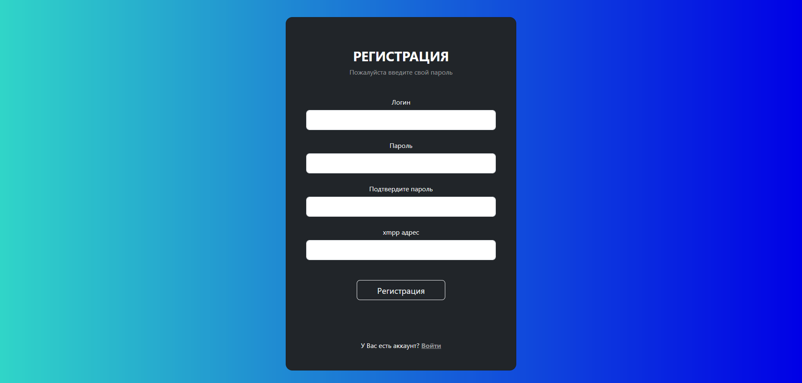

# Sea Battle README 🇺🇦🇺🇦🇺🇦
## 1. Запуск проекта из репозитория
1) Для начала нужно [скачать](https://github.com/QvkkpotentialExplorer/Sea_battle-) репозиторий
2) Открыть редактор кода(Pycharm)
3) Открыть  файл app.py
4) Запустить данный файл
5) Ох максим как много спермы вышло!!!
## 2. Структура данных
*Схема бд*
## 3. Функциональные блоки
```
код
```
## 4. Скриншоты интерфейса
|Логин|

|Регистрация|

## 5. Ссылка на [видео](https://www.youtube.com/) с работой
