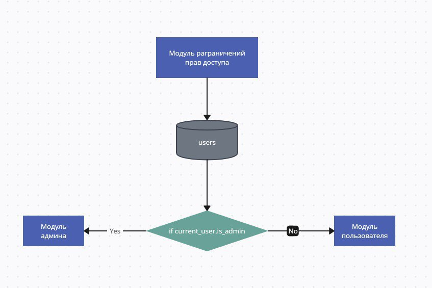
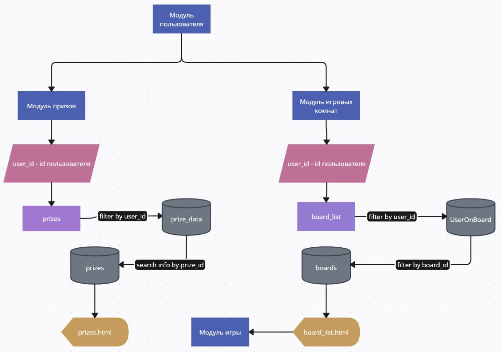

# Sea Battle README
## 1. Запуск проекта из репозитория
1) Для начала нужно [скачать](https://github.com/QvkkpotentialExplorer/Sea_battle-) репозиторий
2) Открыть редактор кода(Pycharm)
3) Открыть  файл app.py
4) Запустить данный файл
## 2. Структура данных
*Схема бд*
## 3. Функциональные блоки
### Модуль разграничения прав

https://github.com/QvkkpotentialExplorer/Sea_battle-/blob/614fe94604ccdea180005c22a9133def1fa2c69c/blueprints/profiles/profile.py#L19-L26

### Модуль пользователя

https://github.com/QvkkpotentialExplorer/Sea_battle-/blob/614fe94604ccdea180005c22a9133def1fa2c69c/data/users.py#L11-L14

## 4. Скриншоты интерфейса
### Логин

### Регистрация

## 5. Ссылка на [видео](https://www.youtube.com/) с работой
