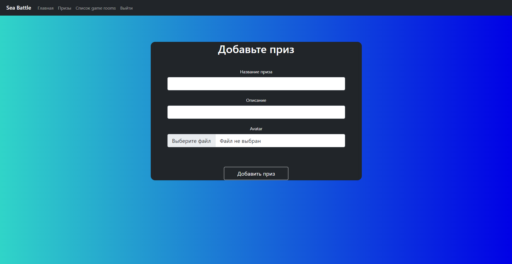

# Sea Battle README
## 1. Запуск проекта из репозитория
1) Скачать репозиторий - ```git clone https://github.com/QvkkpotentialExplorer/Sea_battle-.git```
2) Перейти в папку Sea_battle- - ```cd Sea_battle-```
3) Скачать все требования - ```pip install -r requirements.txt```
4) Запустить файл app.py - ```python app.py```
## 2. Структура данных
### Схема бд

## 3. Функциональные блоки
### Модуль разграничения прав

https://github.com/QvkkpotentialExplorer/Sea_battle-/blob/614fe94604ccdea180005c22a9133def1fa2c69c/blueprints/profiles/profile.py#L19-L26

### Модуль пользователя


https://github.com/QvkkpotentialExplorer/Sea_battle-/blob/614fe94604ccdea180005c22a9133def1fa2c69c/blueprints/profiles/profile.py#L31-L49
https://github.com/QvkkpotentialExplorer/Sea_battle-/blob/b43dae419dbf5f0b1f3001887428663fbe8422a1/blueprints/boards/board.py#L20-L30

### Модуль игрового поля

https://github.com/QvkkpotentialExplorer/Sea_battle-/blob/59f155b856ed63c6a5572dada64f37a7d32ef30a/blueprints/boards/board.py#L35-L49

### Модуль выстрелов

https://github.com/QvkkpotentialExplorer/Sea_battle-/blob/ba2bb57e30f45c35a83698779b47baa561b15d65/blueprints/api/api.py#L34-L73

### Регистрация пользователя


### Регистрация админа

## 4. Скриншоты интерфейса
### Логин

### Регистрация

### Добавление поля

### Выбор поля для игры

### Игровое поле

### Добваление приза

### Список призов

## 5. [Видео](https://www.youtube.com/) с работой
